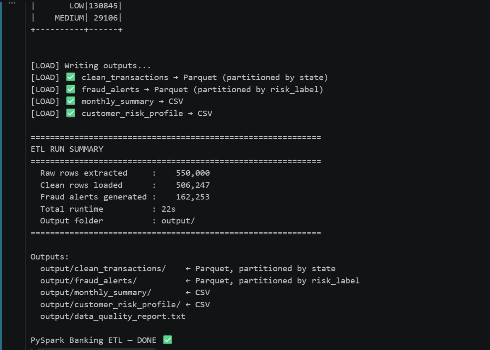

# Banking Transaction ETL Pipeline — PySpark

An end-to-end data engineering pipeline processing **550,000 real banking transactions** using PySpark. Built as part of a mainframe-to-data-engineering transition, demonstrating production-grade ETL patterns on the Azure stack.

---

## What This Pipeline Does

Raw banking CSV → Data Quality Validation → Feature Engineering → Fraud Detection → Partitioned Parquet + CSV outputs

```
Extract        →   Validate         →   Transform          →   Aggregate        →   Load
550k rows CSV      7 DQ checks          12 new columns         Monthly summary      Parquet + CSV
20 columns         Null / dupe /        Risk scoring           Customer risk        Partitioned
                   range checks         Fraud spike flag       profiles             by state
```

---

## Key Features

### Fraud Detection using Window Functions
Detects transaction spikes using `LAG()` — flags any transaction that is more than 3× the previous transaction amount for the same customer. Same pattern used in production banking fraud pipelines.

```python
customer_window = Window.partitionBy("customer_id").orderBy("transaction_date", "transaction_time")

df = df \
    .withColumn("prev_amount", F.lag("transaction_amount", 1).over(customer_window)) \
    .withColumn("spike_flag",
        F.when(F.col("transaction_amount") > F.col("prev_amount") * 3, True)
         .otherwise(False)
    )
```

### Composite Risk Scoring
Five-factor risk model combining fraud history, credit score, account balance, KYC status, and transaction size into a single risk_score (0–100) with HIGH / MEDIUM / LOW labels.

```python
.withColumn("risk_score",
    F.col("is_fraud") * 40 +
    F.when(F.col("credit_score") < 580, 20).otherwise(0) +
    F.when(F.col("account_balance") < 500, 20).otherwise(0) +
    F.when(F.col("kyc_status") != "VERIFIED", 10).otherwise(0) +
    F.when(F.col("transaction_amount") > 50000, 10).otherwise(0)
)
```

### Data Quality Validation
Automated DQ checks on every run — null counts, duplicate IDs, invalid categoricals, out-of-range credit scores, negative amounts. Writes a plain-text report to disk.

### Optimised Parquet Output
Clean transactions written as Parquet partitioned by `state` — enabling partition pruning for regional queries. Fraud alerts partitioned by `risk_label` for fast HIGH-risk retrieval.

---

## Dataset

| Attribute | Value |
|---|---|
| Rows | 550,000 |
| Columns | 20 |
| Domain | Retail banking — transactions, fraud, credit |
| Key fields | transaction_amount, is_fraud, credit_score, kyc_status, merchant_category, channel |

---

## Pipeline Outputs

| Output | Format | Partitioned by | Description |
|---|---|---|---|
| `clean_transactions/` | Parquet | state | Validated + enriched transactions |
| `fraud_alerts/` | Parquet | risk_label | Flagged high-risk transactions |
| `monthly_summary/` | CSV | — | Monthly channel × direction totals |
| `customer_risk_profile/` | CSV | — | Per-customer risk scoring |
| `data_quality_report.txt` | Text | — | Automated DQ report |


---

## Enriched Columns Added

| Column | Logic |
|---|---|
| `risk_score` | Composite 0–100 score from 5 fraud indicators |
| `risk_label` | HIGH / MEDIUM / LOW derived from risk_score |
| `spike_flag` | True if amount > 3× previous transaction (same customer) |
| `hour_band` | NIGHT / MORNING / AFTERNOON / EVENING |
| `is_weekend` | Boolean from transaction_date |
| `is_large_transaction` | True if amount ≥ 95th percentile |
| `amount_usd` | AED → USD conversion (× 0.27) |
| `amount_delta` | Difference from previous transaction (same customer) |
| `days_since_txn` | Calculated from current date |
| `txn_year/month/quarter` | Extracted from transaction_date |
| `customer_risk_tier` | HIGH / MEDIUM / LOW per customer aggregate |

---

## Tech Stack

| Tool | Purpose |
|---|---|
| PySpark 3.5.1 | Distributed data processing |
| Python 3.11 | Pipeline scripting |
| Apache Spark (local mode) | Local execution engine |
| Parquet | Columnar output format |
| Window Functions | Fraud spike detection (LAG) |

---

## How to Run

```bash
# Install dependency
pip install pyspark==3.5.1

# Place your CSV in the project folder
# Update filepath in run() if needed

python pyspark_etl_banking.py
```

**Requirements:** Java JDK 11, Python 3.11, PySpark 3.5.1

---

## Project Structure

```
PySpark_claude/
│
├── pyspark_etl_banking.py     # Main ETL pipeline
├── transactions.csv           # Source dataset (550k rows)
├── README.md                  # This file
│
└── output/
    ├── clean_transactions/    # Parquet — partitioned by state
    ├── fraud_alerts/          # Parquet — partitioned by risk_label
    ├── monthly_summary/       # CSV
    ├── customer_risk_profile/ # CSV
    └── data_quality_report.txt
```

---

## Domain Background

Built by a Data Engineer transitioning from 12 years of Mainframe development across banking (Citi Bank), healthcare (HCA), retail (Walmart), insurance (CNA), and logistics (FedEx). The fraud detection patterns in this pipeline mirror real production logic used in financial services data pipelines.

---

## What I Would Add in Production

- **Airflow DAG** to schedule this pipeline hourly
- **Azure Blob Storage** as source instead of local CSV
- **Delta Lake** for ACID-compliant writes with time travel
- **Azure Data Factory** for orchestration
- **Unit tests** for each transformation function
- **Alerting** when fraud_count spikes above threshold
